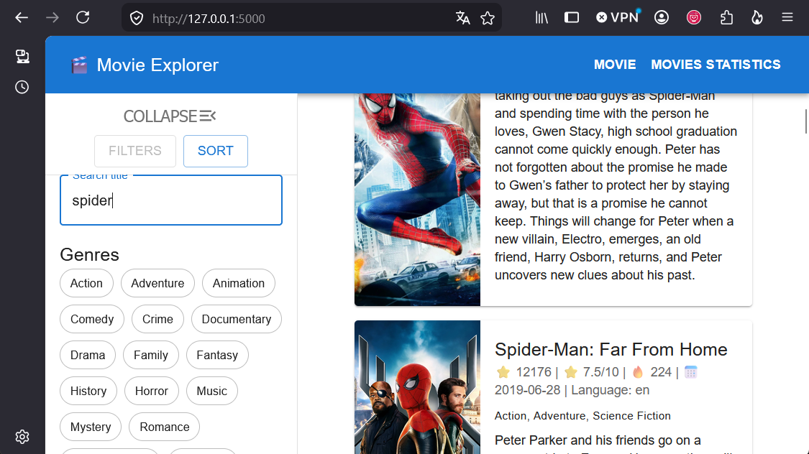
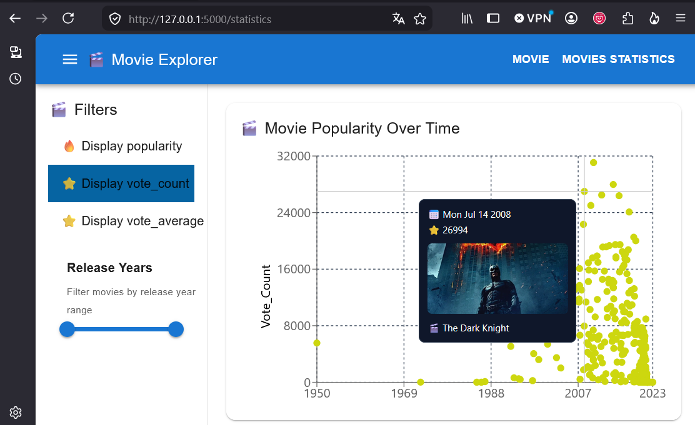
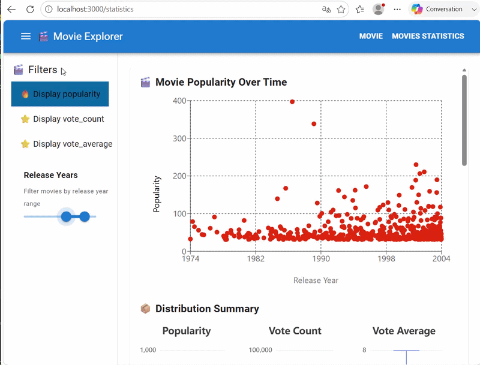

# Project: Challenge – Visualisation d’une base de données de films

## Goal: Sujet
Vous disposez d’un fichier contenant une base de données de films (movies.csv). Votre mission est de produire une plateforme permettant de visualiser au mieux l’intégralité de cette base de données.  


Here is a short illustration of the page rendered.


## Setup (not needed if docker is used - see below)
The project requires the following dependencies:

* [`uv`](https://docs.astral.sh/uv/) or any other Python virtual environment
* npm (version 10 or above) or pnpm
* [nodejs](https://nodejs.org/en/download/), version 22 or above.


* Using [`uv`](https://docs.astral.sh/uv/) package manager

(*Note: this project uses `uv` as the package manager. Other package managers may work but have not been tested.*)
```shell
uv venv --python 3.12  # version 3.12
source .venv/bin/activate
uv pip install -r requirements.txt
```
* Using `npm`package manager
(*Nota: here we are using `npm`as package manager; other packages manager should be working but havenot been tested*)
```shell
cd frontend
npm install
npm run build
```

## Deploy

### 1. Deploy with Docker (recommanded)

For docker installation, please visit [docker website](https://docs.docker.com/engine/install/) 

From the root folder, enter in your terminal: 
```shell
docker build -t webserver .

docker run  --rm -it  -p 5000:5000 webserver --name webserver webserver
# or
docker run -d \
  --name webserver webserver\
  -p 5000:5000 \
    webserver
```

### 2. Deploy without docker
Not recommanded for production
Run the following command from the project root directory:

```shell
gunicorn --bind 0.0.0.0:5000 backend.wsgi:app
```
Then open the application in your web browser: http://localhost:5000
If it does not work, try to open it from an incognito browser window


## Example of usage:

### How to use it? 

The interface provides two pages, detailed below:
1. **main search**: 

This page allows users to search for movies, a side bar can be used to filter or sort results:
- title: look for specific titles
- genre: display movies by genres
- stars (a star equals 2 points): filter movies by rating (average score)
- language: filter movies from their original languages
- release date: narrows the release date range
Another panel called `sort` let the user orders the results, given Popularity, Vote_Count, Vote_Average, and relase dates.  



2. **Movie statistics**

This webpage display statistics on popularity, vote count and vote average.
It allows users to explore whether popularity is correlated with vote count or vote average, regarding the release dates.
Axes are normalized when 2 or more features are displayed (min-max normalization).



Nota: only a maximum of 500 points can be displayed. 

Illustration:



## Debug
for debugging or switching to development mode
* **for backend**:
```shell
cd backend
flask --app app.py --debug run
```
* **for frontend**:

```shell
cd frontend
npm start
```

To run the full project in development mode, start the backend and frontend in two separate terminals.

## Tests

### Backend tests
To test backend, run from the root folder: 

**Unit and integration tests**
```shell

python -m pytest 
```

**Api performance evaluation (stress test):**

```shell
locust -f backend/performance/locustfile.py --host=http://localhost:5000 --headless -u 100 -t 2m --html report.html
```
with `u`number of users
`-t`: stress test time
### Frontend tests 

*coming soon*
## Possible improvements:

**Regarding architecture**:
- Use a SQL database and Grafana (more production-oriented) 
- Deploy with Docker
- refactor some methods

**frontend**: 
- Search within movie descriptions and other text fields.
- Improve React UI components.
- add button to get directly to the top / the bottom of the results
- display more points for graph (current chart displays only 500 points)
- Improve page responsiveness.
- measure website perfs

**backend**:
- Handle errors and invalid API requests. 
- improve application security
- add middleware + nginx as reverse proxy